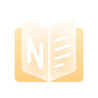

<p align="center">
 
 <h2 align="center">布丁笔记簿</h2>
 <p align="center">一个充满甜品味的计算机知识学习笔记仓库</p>
</p>
<p align="center">
  <a href="https://www.nousbuild.org/">
  	
  </a>
  <a href="https://pudding.nousbuild.com/">
  	
  </a>
  <a href="https://github.com/pudding0503/friends">
  	
  </a>
  <a href="https://www.nousbuild.org/support/">
      
  </a>
  <a href="https://github.com/pudding0503/friends/issues">
  	
  </a>
</p>

<p align="center">
  <a href="https://github.com/pudding0503">
    
  </a>
</p>

### 1. 什么是布丁笔记簿？

布丁笔记簿，主要是用来整理、记录和总结一些计算机相关知识。

### 2. 主站友链申请

如果你的网站（或博客）是计算机 / 插画 / 设计作品集这三种类别之一，且打算长期运行的，同时没有植入乱七八糟广告的，可以[申请我的主站友链](https://github.com/pudding0503/friends)，并且很高兴可以相互认识。

### 3. 笔记簿友情链接

你可以同时申请布丁笔记簿的友情链接，操作步骤如下：

#### 3.1 首先确保有本站的友情链接：

```
名称：布丁笔记簿
简介：一个充满甜品味的计算机知识学习笔记仓库
链接：https://pudding.nousbuild.com
图标：https://pudding.nousbuild.com/pwa@512.png
```

#### 3.2 友链条件

1. 你的网站内容**必须**是**计算机 / 插画 / 设计作品集**类别之一
2. 你的网站运营时间不小于**3个月**（以确定不会随随便便删库跑路）
3. 你需要有一个**顶级域名**（如果你的博客使用二级域名，需要验证主域名所有权）
4. 你的网站**必须**支持 **HTTPS** 访问（允许不强制跳转）
5. 确保你的网站内容不违反中国大陆法律
6. 拥有尽可能多的原创内容，越多优先级越高
7. 如果因特殊原因而更换网站地址，请再次留言
8. 你的网站**超过3个月**无法访问将可能被移除

#### 3.3 提交申请

访问 [友情链接](https://github.com/pudding0503/friends/issues) 页面，直接留言即可，按照 Markdown 格式填写必要内容。
